# Diagram 03 — Backend Component Diagram

This diagram shows the component-level organization of the backend service layer, repository pattern, middleware pipeline, and data access components.

---

## 🎨 Visual Diagram (Mermaid Render)

```mermaid
graph LR
    subgraph Routes [" 🛣️ Route Handlers "]
        AuthRoutes["/api/v1/auth"]
        OrgRoutes["/api/v1/organizations"]
        TicketRoutes["/api/v1/tickets"]
        PRRoutes["/api/v1/pull-requests"]
        AuditRoutes["/api/v1/audit"]
    end

    subgraph Middlewares [" 🛡️ Middleware Pipeline "]
        AuthMW["authenticate.ts"]
        TenantMW["tenantContext.ts"]
        RBACMW["authorize.ts"]
        RateMW["rateLimiter.ts"]
    end

    subgraph Controllers [" 🎮 Controllers "]
        AuthCtrl["auth.controller.ts"]
        OrgCtrl["organization.controller.ts"]
        TicketCtrl["ticket.controller.ts"]
        PRCtrl["pullRequest.controller.ts"]
    end

    subgraph Services [" 🧠 Service Layer "]
        AuthSvc["AuthService"]
        OrgSvc["OrganizationService"]
        TicketSvc["TicketService"]
        PRSvc["PullRequestService"]
        AuditSvc["AuditService"]
    end

    subgraph Repositories [" 🗄️ Repositories "]
        UserRepo["UserRepository"]
        OrgRepo["OrganizationRepository"]
        MemberRepo["MemberRepository"]
        TicketRepo["TicketRepository"]
        PRRepo["PullRequestRepository"]
        AuditRepo["AuditRepository"]
    end

    Routes --> Middlewares
    Middlewares --> Controllers
    Controllers --> Services
    Services --> Repositories
    Repositories -->|Prisma ORM| DB[("PostgreSQL")]
```

---

## 📄 Raw PlantUML Source File

Source file available at [`./03_backend_component.puml`](./03_backend_component.puml).
