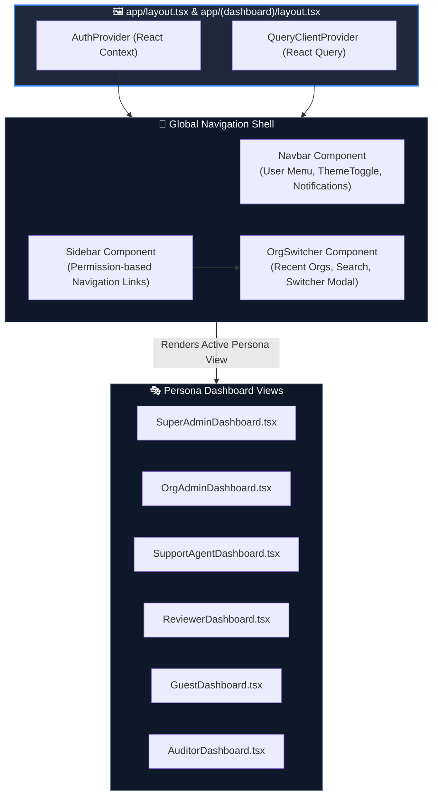

# Diagram 04 — Frontend Component Diagram

This diagram shows the React / Next.js presentation layer component hierarchy, client context state, and navigation wrappers.

---

## 🎨 Visual Diagram (Mermaid Render)

---

## 📄 Raw PlantUML Source File

Source file available at [`./04_frontend_component.puml`](./04_frontend_component.puml).
