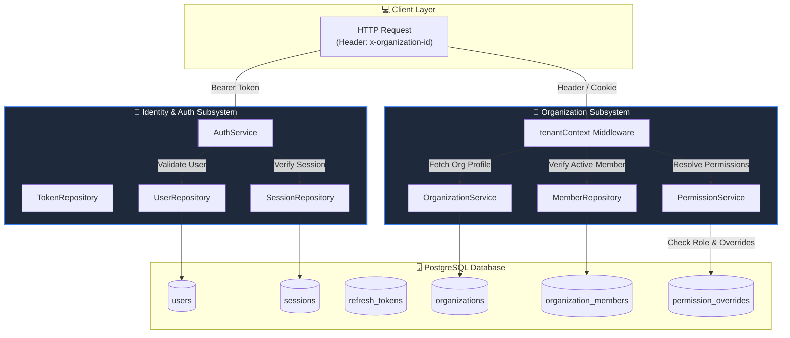

# Diagram 05 — Identity & Organization Service Deep Dive

This diagram illustrates the internals of `AuthService` and `OrganizationService`, including tenant context resolution, session database storage, member repositories, and permission resolution.

---

## 🎨 Visual Diagram (Mermaid Render)

