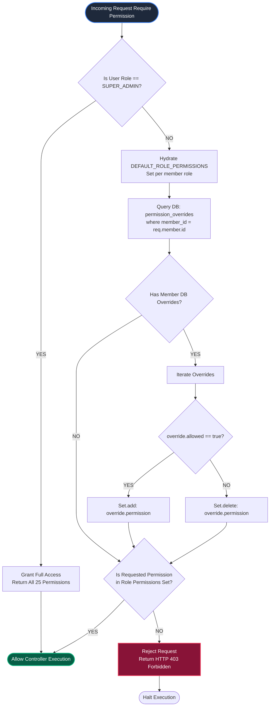

# Diagram 08 — RBAC Decision Flow Diagram

This diagram details the decision tree executed during permission resolution, showing Super Admin global bypass checks, default role permission hydration, and DB-level `PermissionOverride` evaluation.

---

## 🎨 Visual Diagram (Mermaid Render)

