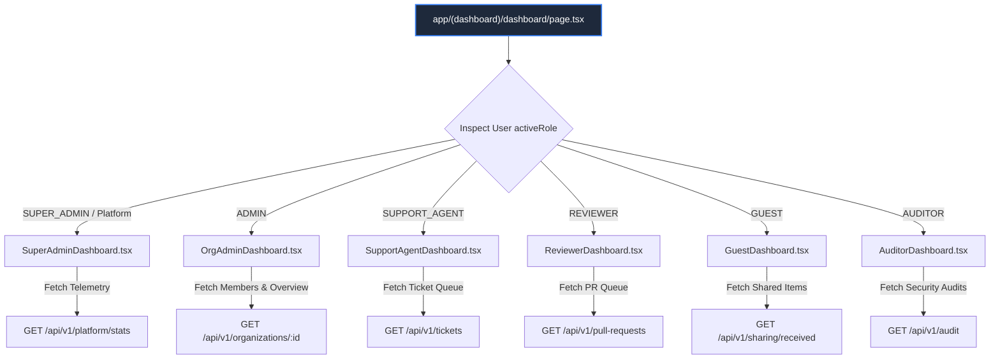

# Diagram 10 — Dashboard Component & Layout Architecture

This diagram shows component composition, widget data binding, layout wrappers, and API route mappings for the 6 persona dashboards.

---

## 🎨 Visual Diagram (Mermaid Render)

