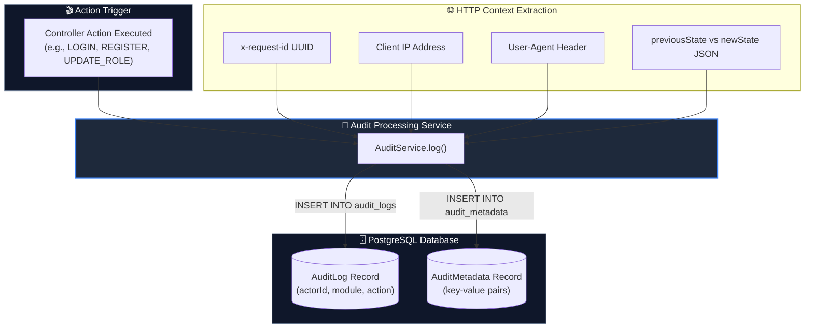

# Diagram 13 — Security Audit Logging Pipeline

This diagram shows how audit events are captured, enriched with HTTP metadata (IP address, User-Agent, Request ID), processed by `AuditService`, and persisted to `AuditLog` and `AuditMetadata` tables.

---

## 🎨 Visual Diagram (Mermaid Render)

