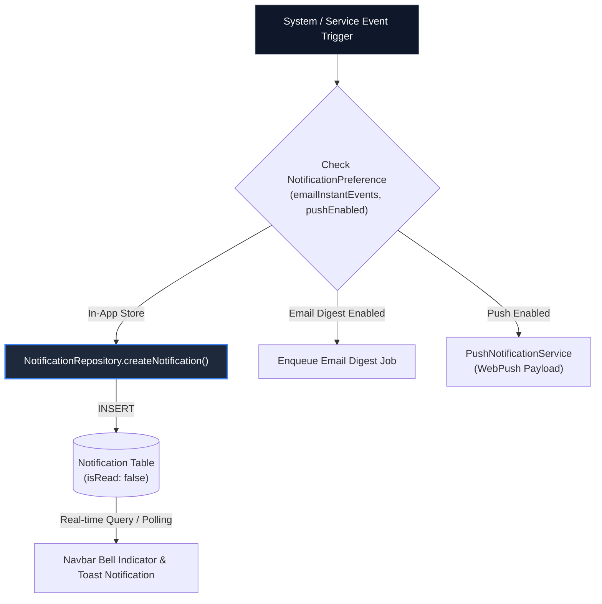

# Diagram 14 — Multi-Channel Notification Pipeline

This diagram illustrates how notification events (`AI_DIGEST`, `TICKET_ASSIGNED`, `REVIEW_ASSIGNED`, `SHARE_RECEIVED`) are evaluated against user preferences and dispatched to in-app notification stores.

---

## 🎨 Visual Diagram (Mermaid Render)

