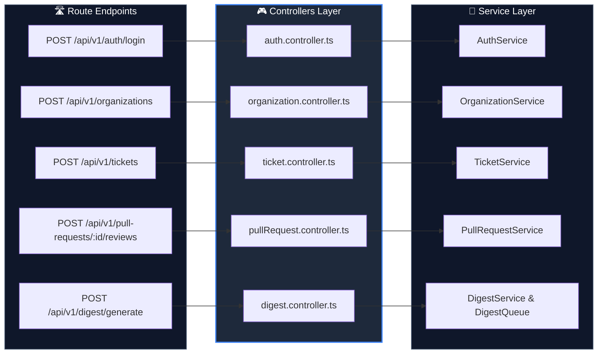

# Diagram 18 — API Interaction & Controller Routing Diagram

This diagram shows API route mapping, controller delegation, and service layer call graphs.

---

## 🎨 Visual Diagram (Mermaid Render)

```mermaid
graph LR
    subgraph Routes [" 🛣️ Route Endpoints "]
        R1["POST /api/v1/auth/login"]
        R2["POST /api/v1/organizations"]
        R3["POST /api/v1/tickets"]
        R4["POST /api/v1/pull-requests/:id/reviews"]
        R5["POST /api/v1/digest/generate"]
    end

    subgraph Controllers [" 🎮 Controllers Layer "]
        C1["auth.controller.ts"]
        C2["organization.controller.ts"]
        C3["ticket.controller.ts"]
        C4["pullRequest.controller.ts"]
        C5["digest.controller.ts"]
    end

    subgraph Services [" 🧠 Service Layer "]
        S1["AuthService"]
        S2["OrganizationService"]
        S3["TicketService"]
        S4["PullRequestService"]
        S5["DigestService & DigestQueue"]
    end

    R1 --> C1 --> S1
    R2 --> C2 --> S2
    R3 --> C3 --> S3
    R4 --> C4 --> S4
    R5 --> C5 --> S5

    style Routes fill:#0f172a,stroke:#64748b,stroke-width:1px,color:#fff
    style Controllers fill:#1e293b,stroke:#3b82f6,stroke-width:2px,color:#fff
    style Services fill:#0f172a,stroke:#64748b,stroke-width:1px,color:#fff
```
