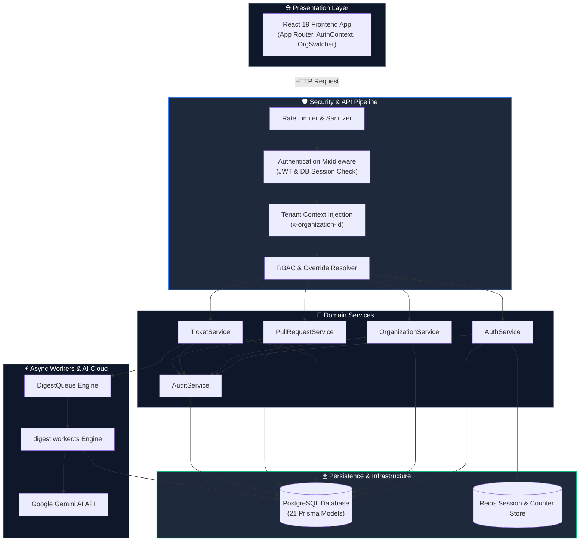

# Diagram 20 — End-to-End Complete System Data Flow Diagram

This diagram visualizes the end-to-end data trajectory across the entire platform, connecting user actions, presentation state, API middleware, services, data persistence, worker background jobs, AI services, and security logging.

---

## 🎨 Visual Diagram (Mermaid Render)

