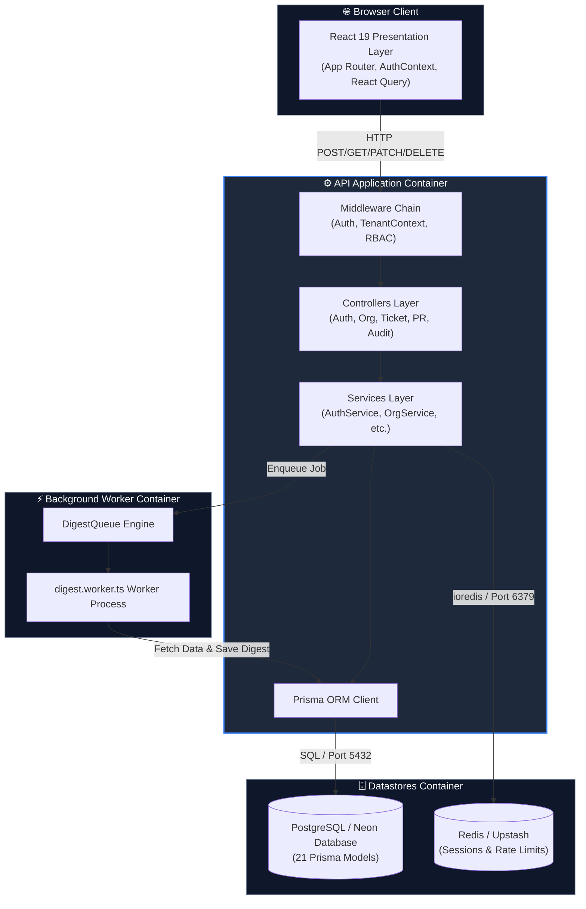

# Diagram 02 — Container Topology Diagram

This diagram shows the container-level architecture of the **Unified Organization Workspace**, highlighting responsibilities, data flow, protocols, and boundaries across containers.

---

## 🎨 Visual Diagram (Mermaid Render)

---

## 📄 Raw Structurizr Source File

Source file available at [`./02_container_diagram.c4`](./02_container_diagram.c4).
