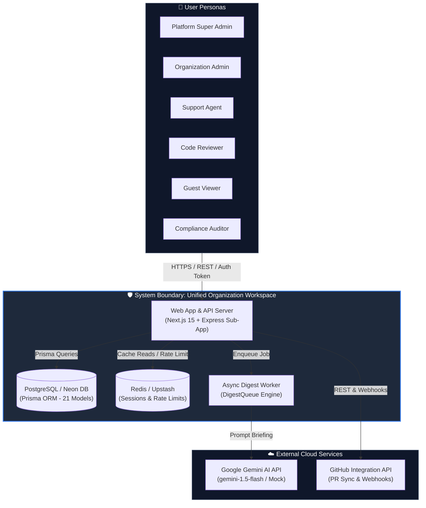

# Diagram 01 — System Context Diagram

This diagram depicts the high-level system context of the **Unified Organization Workspace** platform using the C4 Model, showing interactions between core personas, system boundaries, and external services.

> **Diagram Technology Rationale**: C4 Structurizr DSL is selected for System Context because it provides strict, standard enterprise abstraction boundaries (System vs. Person vs. External Service) without visual noise.

---

## 🎨 Visual Diagram (Mermaid Render)

---

## 📄 Raw Structurizr Source File

Reviewers can edit and export the raw C4 Structurizr DSL file located at [`./01_system_context.c4`](./01_system_context.c4).
