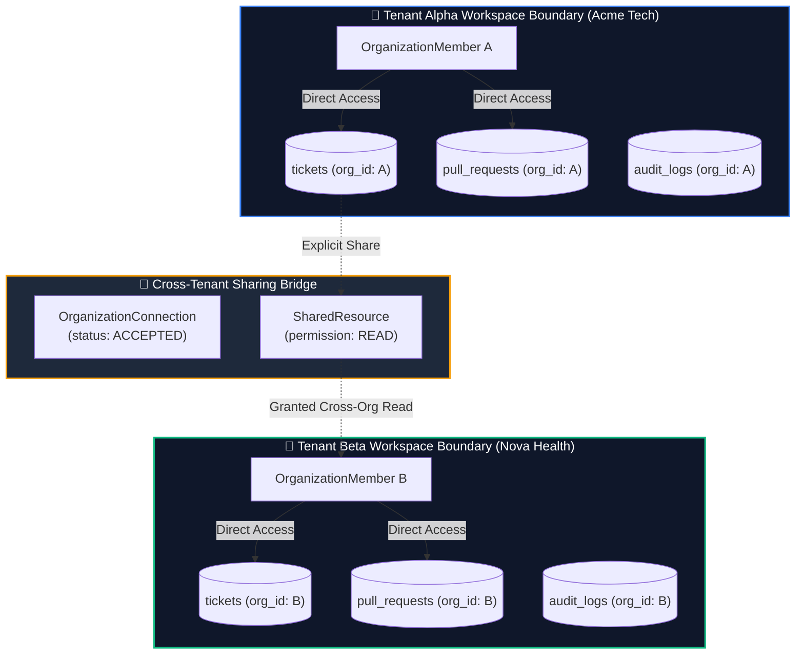

# Diagram 09 — Tenant Isolation & Multi-Tenancy Boundary Diagram

This diagram shows multi-tenant database isolation boundaries, foreign key context filters, and cross-organization sharing bridge trust boundaries.

---

## 🎨 Visual Diagram (Mermaid Render)

---

## 📄 Raw PlantUML Source File

Source file available at [`./09_tenant_isolation.puml`](./09_tenant_isolation.puml).
