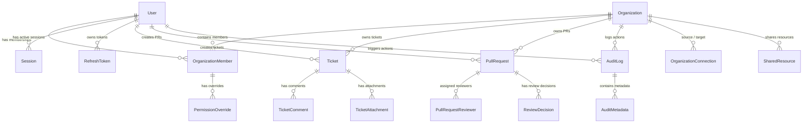

# Diagram 15 — Database Entity-Relationship (ER) Diagram

This diagram visualizes the complete entity relationships across the 21 Prisma database models and foreign key constraints.

---

## 🎨 Visual Diagram (Mermaid Render)

---

## 📄 Raw PlantUML Source File

Source file available at [`./15_database_er_diagram.puml`](./15_database_er_diagram.puml).
