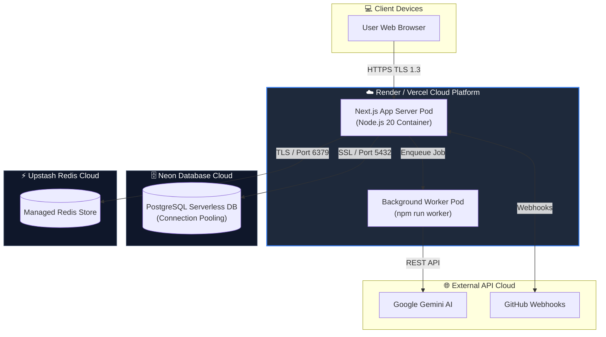

# Diagram 16 — Physical & Containerized Deployment Diagram

This diagram shows physical server nodes, Vercel / Render cloud infrastructure, Docker container runtime setups, and cloud datastores.

---

## 🎨 Visual Diagram (Mermaid Render)

---

## 📄 Raw PlantUML Source File

Source file available at [`./16_deployment.puml`](./16_deployment.puml).
