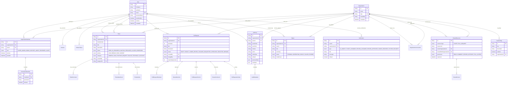

# Database Entity-Relationship (ER) Diagram

Entity-Relationship Diagram for the **Unified Organization Workspace** PostgreSQL database.

---

```mermaid
erDiagram
    User ||--o{ OrganizationMember : "belongs_to"
    User ||--o{ Session : "has_sessions"
    User ||--o{ RefreshToken : "has_tokens"
    User ||--o{ Ticket : "creates_tickets"
    User ||--o{ Ticket : "assigned_tickets"
    User ||--o{ PullRequest : "creates_prs"
    User ||--o{ AuditLog : "acts_in"
    User ||--o{ Digest : "receives_digests"
    User ||--o{ Notification : "receives_notifications"

    Organization ||--o{ OrganizationMember : "has_members"
    Organization ||--o{ Ticket : "owns_tickets"
    Organization ||--o{ PullRequest : "owns_prs"
    Organization ||--o{ AuditLog : "scoped_logs"
    Organization ||--o{ OrganizationConnection : "source_org"
    Organization ||--o{ OrganizationConnection : "target_org"
    Organization ||--o{ SharedResource : "owner_org"
    Organization ||--o{ SharedResource : "received_org"
    Organization ||--o{ Digest : "org_digests"
    Organization ||--o{ FeatureFlag : "org_flags"

    OrganizationMember ||--o{ PermissionOverride : "overrides"

    Ticket ||--o{ TicketComment : "has_comments"
    Ticket ||--o{ TicketAttachment : "has_attachments"
    Ticket ||--o{ TicketActivity : "has_timeline"

    PullRequest ||--o{ PullRequestReviewer : "reviewers"
    PullRequest ||--o{ ReviewDecision : "decisions"
    PullRequest ||--o{ PullRequestVersion : "versions"
    PullRequest ||--o{ ReviewComment : "comments"
    PullRequest ||--o{ PullRequestActivity : "activity"

    AuditLog ||--o{ AuditMetadata : "metadata"
    SharedResource ||--o{ SharedAccess : "guest_access"

    User {
        string id PK
        string firstName
        string lastName
        string email UK
        string passwordHash
        boolean emailVerified
        boolean isActive
        datetime createdAt
    }

    Organization {
        string id PK
        string name
        string slug UK
        string createdBy
        datetime createdAt
    }

    OrganizationMember {
        string id PK
        string organizationId FK
        string userId FK
        enum role "SUPER_ADMIN | ADMIN | SUPPORT_AGENT | REVIEWER | GUEST"
        boolean isActive
        datetime joinedAt
    }

    PermissionOverride {
        string id PK
        string memberId FK
        string permission
        boolean allowed
    }

    Ticket {
        string id PK
        string organizationId FK
        int ticketNumber
        string title
        string description
        enum status "OPEN | IN_PROGRESS | WAITING | RESOLVED | CLOSED | REOPENED"
        enum priority "LOW | MEDIUM | HIGH | URGENT"
        enum category "GENERAL | BUG | FEATURE_REQUEST | BILLING | TECHNICAL | ACCOUNT"
        string createdBy FK
        string assignedTo FK
    }

    PullRequest {
        string id PK
        string organizationId FK
        int prNumber
        string title
        string description
        enum status "DRAFT | READY | UNDER_REVIEW | CHANGES_REQUESTED | APPROVED | REJECTED | MERGED"
        string createdBy FK
        string mergedBy FK
        int requiredApprovals
    }

    AuditLog {
        string id PK
        string organizationId FK
        string actorId FK
        string actorEmail
        string actorRole
        string module
        string action
        string entityType
        string entityId
        json previousState
        json newState
    }

    SharedResource {
        string id PK
        enum resourceType "TICKET | PULL_REQUEST"
        string resourceId
        string ownerOrganizationId FK
        string sharedWithOrganizationId FK
        enum permission "READ | COMMENT | REVIEW | APPROVE | FULL_ACCESS"
        datetime expiresAt
    }

    Digest {
        string id PK
        string organizationId FK
        string userId FK
        string title
        text summary
        enum status "PENDING | GENERATING | READY | FAILED | EXPIRED"
        string modelUsed
    }

    Notification {
        string id PK
        string userId FK
        string organizationId FK
        enum type "AI_DIGEST | TICKET_ASSIGNED | REVIEW_ASSIGNED | REVIEW_APPROVED | SHARE_RECEIVED | SYSTEM | SECURITY"
        string title
        string message
        boolean isRead
    }

    FeatureFlag {
        string id PK
        string key
        string description
        boolean enabled
        string organizationId FK
    }
```
