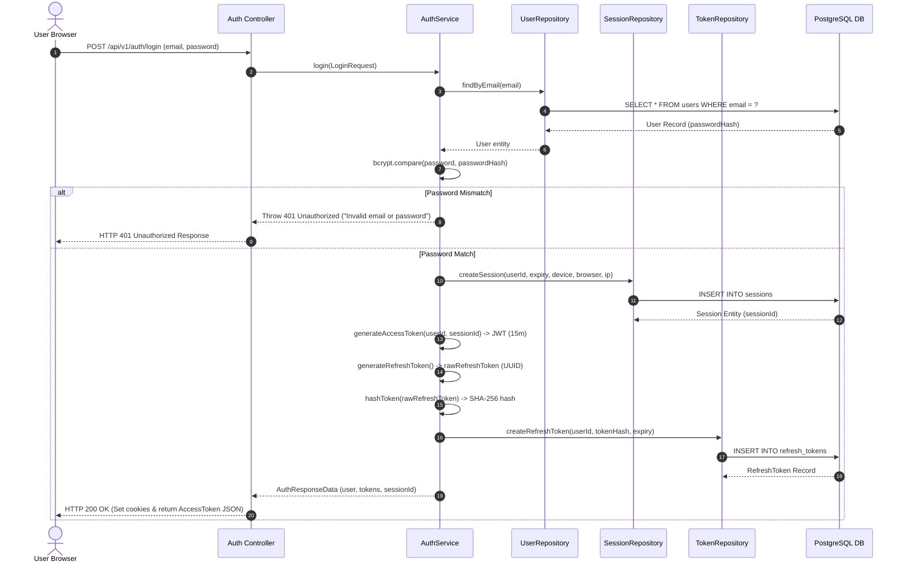

# Diagram 06 — Authentication Sequence Diagram

This sequence diagram details the full login execution flow, password verification, JWT access token generation, SHA-256 refresh token hashing, and session DB record creation.

---

## 🎨 Visual Diagram (Mermaid Render)

