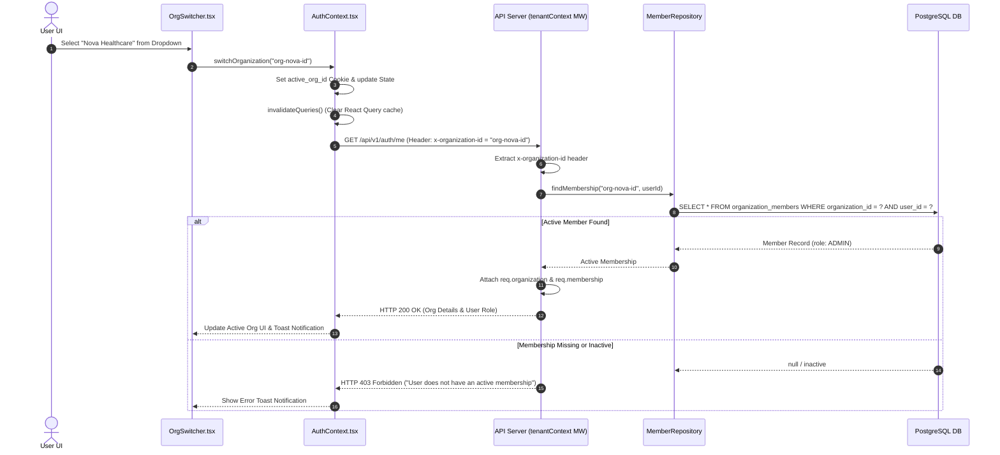

# Diagram 07 — Organization Switching Sequence Diagram

This sequence diagram illustrates client-side organization selection, cookie setting, header injection, server-side membership verification, and context re-hydration.

---

## 🎨 Visual Diagram (Mermaid Render)

