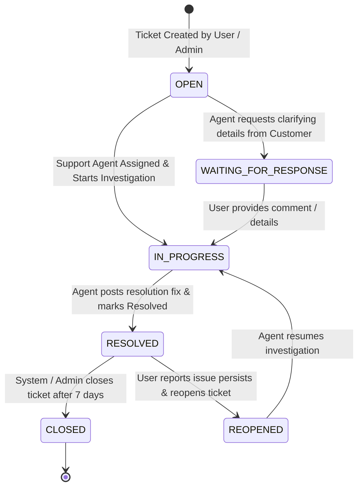

# Diagram 11 — Support Ticket Lifecycle & State Machine

This sequence diagram depicts the support ticket lifecycle state transitions (`OPEN` -> `IN_PROGRESS` -> `WAITING_FOR_RESPONSE` -> `RESOLVED` -> `CLOSED` / `REOPENED`), commenting, activity auditing, and assignment.

---

## 🎨 Visual Diagram (Mermaid Render)

