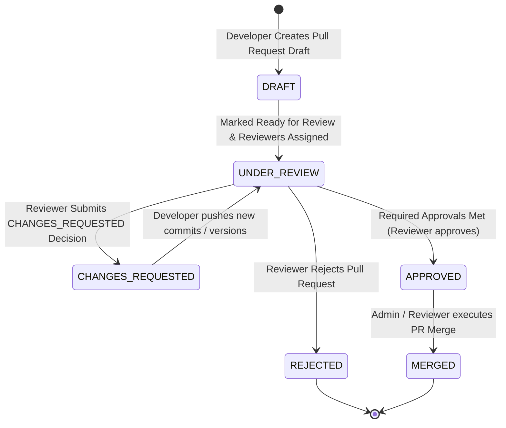

# Diagram 12 — Pull Request Code Review Workflow

This sequence diagram depicts the pull request code review workflow state machine (`DRAFT` -> `UNDER_REVIEW` -> `CHANGES_REQUESTED` / `APPROVED` -> `MERGED`).

---

## 🎨 Visual Diagram (Mermaid Render)

