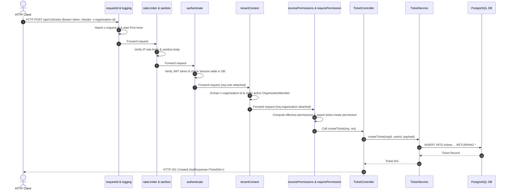

# Diagram 17 — Request Execution Lifecycle Diagram

This diagram details the step-by-step HTTP execution path through the 8 middleware stages, controller handler, service method, repository layer, and response formatting.

---

## 🎨 Visual Diagram (Mermaid Render)

