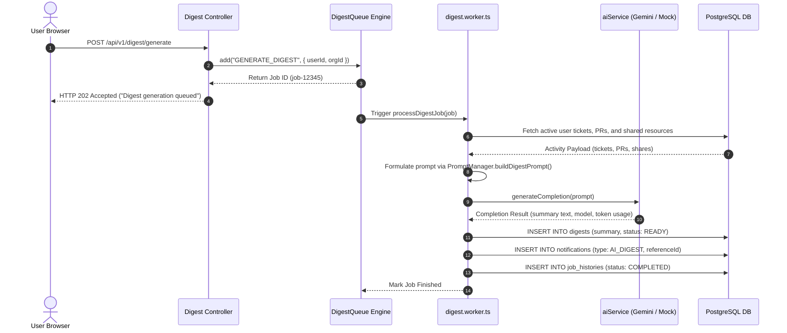

# Diagram 19 — Background Job Execution Flow Diagram

This sequence diagram details the asynchronous queueing, worker consumption, Gemini AI completion call, database digest persistence, notification creation, and job history recording flow.

---

## 🎨 Visual Diagram (Mermaid Render)

