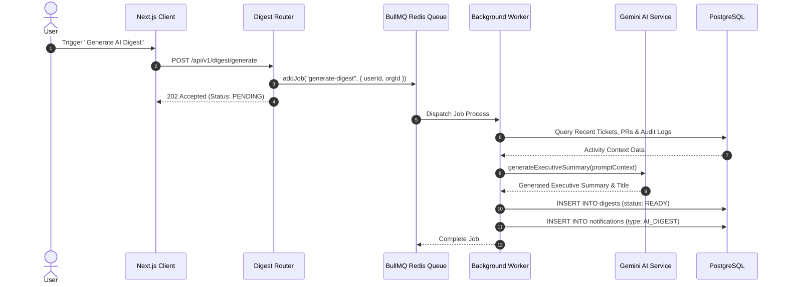
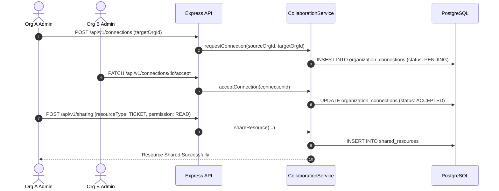

# Core System Sequence Diagrams

Sequence diagrams illustrating core platform workflows in the **Unified Organization Workspace**.

---

## 1. Authentication & Session Management Flow

```mermaid
sequenceDiagram
    autonumber
    actor User
    participant Client as Next.js Client
    participant AuthAPI as Express Auth Router
    participant AuthService as AuthService
    participant DB as PostgreSQL
    participant Redis as Redis Session Cache

    User->>Client: Submit Credentials (Email & Password)
    Client->>AuthAPI: POST /api/v1/auth/login
    AuthAPI->>AuthService: login(data, meta)
    AuthService->>DB: findByEmail(email)
    DB-->>AuthService: User Record & Password Hash
    AuthService->>AuthService: bcrypt.compare(password, passwordHash)
    AuthService->>DB: createSession(userId, expiry, device, IP)
    DB-->>AuthService: Session Record (sid)
    AuthService->>AuthService: generateAccessToken(userId, sid) & generateRefreshToken()
    AuthService->>DB: createRefreshToken(userId, tokenHash)
    AuthService-->>AuthAPI: Auth Tokens & User Payload
    AuthAPI-->>Client: 200 OK (AccessToken, RefreshToken Cookie, User Payload)
    Client-->>User: Navigate to Workspace Dashboard
```

---

## 2. Ticket Creation & Audit Trail Pipeline

```mermaid
sequenceDiagram
    autonumber
    actor User
    participant Client as Next.js Client
    participant API as Express API Pipeline
    participant AuthMW as Auth & Tenant Context MW
    participant PermMW as RBAC Permission MW
    participant TicketService as TicketService
    participant DB as PostgreSQL
    participant AuditService as AuditService

    User->>Client: Click "Create Ticket"
    Client->>API: POST /api/v1/tickets (X-Organization-Id)
    API->>AuthMW: Authenticate Token & Resolve Tenant Context
    AuthMW-->>API: Valid User & Member Context
    API->>PermMW: requirePermission(TICKET_CREATE)
    PermMW-->>API: Permission Granted
    API->>TicketService: createTicket(data, userId, orgId)
    TicketService->>DB: INSERT INTO tickets
    DB-->>TicketService: Created Ticket Record
    TicketService->>AuditService: log(module: SUPPORT_HUB, action: TICKET_CREATE)
    AuditService->>DB: INSERT INTO audit_logs & audit_metadata
    TicketService-->>API: Ticket Payload
    API-->>Client: 201 Created (Ticket Data & Audit Trace ID)
```

---

## 3. AI Digest Background Queue Workflow



---

## 4. Cross-Organization Resource Sharing Handshake


